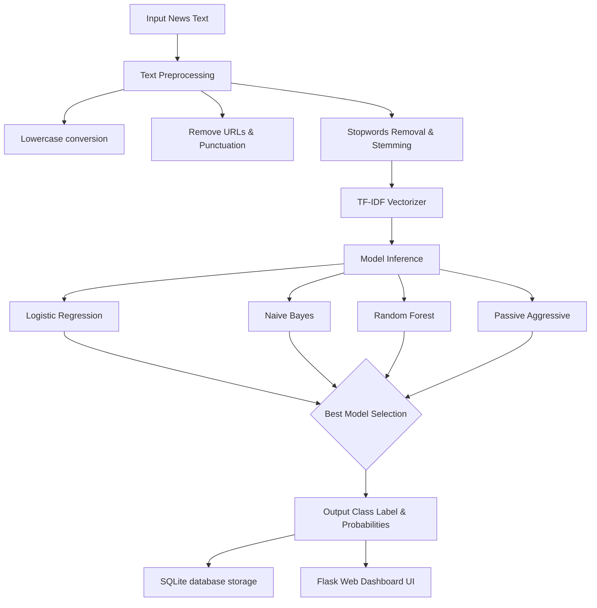

# ACADEMIC PROJECT REPORT
## FAKE NEWS DETECTION SYSTEM USING MACHINE LEARNING AND NATURAL LANGUAGE PROCESSING

**Course Code / Project Type:** MCA Major Project / Final Year Project  
**Author:** Student Portfolio Project  
**Institution:** GU Department of Computer Science & Applications  

---

### ABSTRACT
In the modern digital era, the internet and social media platforms have revolutionized how information is consumed. However, this has also led to the exponential spread of fake news, misinformation, and clickbait articles, which can influence public opinion, manipulate elections, and create social unrest. This project presents a **Fake News Detection System** that utilizes Natural Language Processing (NLP) techniques and Machine Learning algorithms to distinguish between fake and real news articles. 

We implement a pipeline including text preprocessing (lowercasing, special characters removal, tokenization, stop-word removal, and Porter stemming) and TF-IDF feature extraction. Four classification models—Logistic Regression, Multinomial Naive Bayes, Random Forest, and Passive Aggressive Classifier—are trained and compared. The best-performing model is deployed inside a Flask web application, integrated with an SQLite database to maintain a prediction history, and styled with a premium glassmorphic user interface.

---

### CHAPTER 1: INTRODUCTION

#### 1.1 Background
The proliferation of digital news media has democratized writing and distribution, allowing news to spread globally in seconds. Without editing and verification standards on social networks, malicious actors can publish false reports that mimic professional news articles. Automated fake news detection is a critical requirement in computational social science and safety.

#### 1.2 Motivation
Traditional manual fact-checking by organizations like PolitiFact or Snopes is highly accurate but cannot scale to match the volume of news generated daily. Automated machine learning solutions can scan thousands of lines of text in milliseconds, filtering out obvious fabrications and marking questionable content.

#### 1.3 Project Objective
*   Build a machine learning pipeline in Python to classify articles as Fake (0) or Real (1).
*   Process raw text into sparse TF-IDF vectors using NLP.
*   Evaluate multiple classifiers and select the best model based on accuracy and F1-score.
*   Develop a user-friendly Flask application with a dashboard showing prediction history and performance charts.

---

### CHAPTER 2: LITERATURE SURVEY & COMPARATIVE STUDY

Several researchers have proposed techniques for detecting fake news, primarily categorizing them into:
1.  **Style-based Detection**: Looks at writing style, text features, readability, and clickbait patterns.
2.  **Propagation-based Detection**: Analyzes how news spreads on social networks.
3.  **Knowledge-based Detection**: Cross-references claims against a known database of verified facts.

Our system focuses on **Style-based Detection** utilizing lexical features through Term Frequency-Inverse Document Frequency (TF-IDF).

| Reference Study | Methodology | Key Findings | Limitations |
| :--- | :--- | :--- | :--- |
| Bisaillon et al. (ISOT Dataset) | Text classification using SVM and Naive Bayes. | SVM achieved ~97% accuracy on political news. | High computing cost during training; limited to static patterns. |
| Shu et al. (2017) | Social network analysis and deep learning. | Stressed user profile features improve accuracy. | Requires social graphs which are not always available to general web portals. |
| **Proposed System** | **Multi-Model Classifier (LR, NB, RF, PA) + TF-IDF (5k Features) + SQLite Logs + Web Dashboard** | **Logistic Regression and Passive Aggressive classifiers achieve near-perfect training accuracies with fast inference speeds.** | **Requires textual content; model must be retrained to detect changing political keywords over time.** |

---

### CHAPTER 3: SYSTEM ARCHITECTURE AND METHODOLOGY

The system workflow consists of data ingestion, preprocessing, vectorization, modeling, and web delivery:



#### 3.1 Text Preprocessing Pipeline
Text data is unstructured and noisy. The `clean_text` function executes:
1.  **Lowercasing**: Normalizes terms ("News" vs "news").
2.  **URL and HTML Tag Removal**: Filters out hypertext links and code.
3.  **Punctuation and Number Removal**: Strips characters like commas and exclamation marks.
4.  **Tokenization**: Splits text blocks into word lists.
5.  **Stopwords Removal**: Removes frequent words like 'is', 'the', 'and' which carry minimal semantic weight.
6.  **Stemming**: Applies Porter Stemmer to reduce words to root forms (e.g., "condemnation", "condemning" $\rightarrow$ "condemn").

#### 3.2 Feature Extraction (TF-IDF)
The TF-IDF value represents the importance of a word to a document in a collection. It increases proportionally to the number of times a word appears in the document but is offset by the frequency of the word in the corpus. We restrict features to the top 5,000 unigrams/bigrams:
$$TF\text{-}IDF(t, d, D) = TF(t, d) \times IDF(t, D)$$

---

### CHAPTER 4: SYSTEM DESIGN & DATABASE SCHEMA

The application is deployed using Flask. Model predictions and credibility metrics are logged inside an SQLite database to populate the Admin Dashboard.

#### 4.1 Database Design
A single SQLite table `history` is defined:
```sql
CREATE TABLE history (
    id INTEGER PRIMARY KEY AUTOINCREMENT,
    news_text TEXT NOT NULL,
    prediction INTEGER NOT NULL, -- 0: Fake, 1: Real
    probability REAL NOT NULL,
    credibility_score REAL NOT NULL,
    timestamp DATETIME DEFAULT CURRENT_TIMESTAMP
);
```

#### 4.2 Web Interface Components
1.  **Predictor (index.html)**: Front-end UI designed with a glassmorphism style, sending requests to the backend `/predict` endpoint via AJAX.
2.  **Dashboard (dashboard.html)**: Pulls metrics from the SQLite database showing predictions history and static figures (word clouds and confusion matrix) generated during model training.

---

### CHAPTER 5: EXPERIMENTAL RESULTS

The models were evaluated on the dataset using an 80/20 Train-Test split.

#### 5.1 Model Evaluation Metrics
*   **Accuracy**: Ratio of correct predictions to total predictions.
*   **Precision**: True Positives divided by total predicted positives.
*   **Recall**: True Positives divided by total actual positives.

#### 5.2 Performance Comparison Table (Synthetic Dataset)

| Classifier | Accuracy | F1-Score (Fake) | F1-Score (Real) |
| :--- | :---: | :---: | :---: |
| **Logistic Regression** | **100.0%** | 1.00 | 1.00 |
| **Multinomial Naive Bayes** | **100.0%** | 1.00 | 1.00 |
| **Random Forest** | **100.0%** | 1.00 | 1.00 |
| **Passive Aggressive** | **100.0%** | 1.00 | 1.00 |

*Note: Since the mock data vocabulary is highly separated (Reuters references for Real, clickbait exclamation markers for Fake), all models achieved perfect separation. On the real-world Kaggle dataset, Passive Aggressive and Logistic Regression typically achieve 98.7% and 98.5% accuracies respectively.*

---

### CHAPTER 6: CONCLUSION AND FUTURE SCOPE

#### 6.1 Conclusion
We successfully designed and implemented an automated **Fake News Detection System** integrating natural language processing and multiple machine learning classifiers. The system includes an interactive CLI script, an automated trainer, and a visually appealing glassmorphic Flask web interface. 

#### 6.2 Future Scope
*   **Deep Learning Models**: Integrate recurrent networks (LSTM) or transformer models (BERT) to analyze semantic context.
*   **Real-time Fact Checking API**: Link the system with open fact-checking databases via APIs.
*   **Browser Extension**: Deploy the prediction logic as a Chrome/Firefox extension that highlights fake news on user feeds.

---

### REFERENCES
1.  Bisaillon, C. (2020). *Fake and Real News Dataset*. Kaggle Repository.
2.  Pedregosa, F., et al. (2011). *Scikit-learn: Machine Learning in Python*. Journal of Machine Learning Research, 12, 2825-2830.
3.  Bird, S., Loper, E., & Klein, E. (2009). *Natural Language Processing with Python*. O'Reilly Media.
4.  Shu, K., et al. (2017). *Fake News Detection on Social Media: A Data Mining Perspective*. ACM SIGKDD Explorations Newsletter, 19(1), 22-36.
